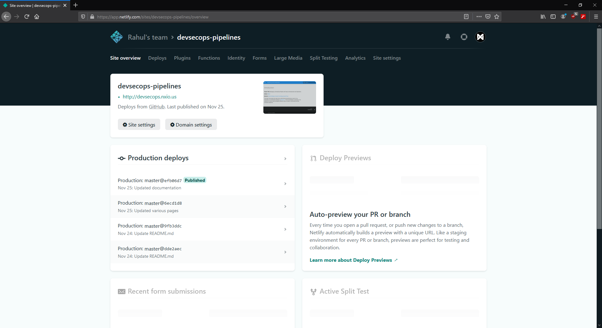
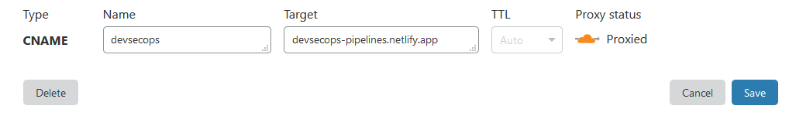

# Deploying the report

## Objective

This section aims at completing the objectives listed under [`Task 2`](../problem-statement#task-2) as per the [Problem Statement](../problem-statement).

## Need for documentation

The presence of documentation assists with all parts of an application and it enhances the quality of the project. It aims at transferring the knowledge to other developers, allow further development and introduce ease of maintenance.

## Tools and methodology

The tools I used to build and deploy the documentation are MkDocs, Netlify and Github. The goal was to generate the documentation using MkDocs, push it to Github and deploy it via Netlify. 

## MkDocs

MkDocs is a simple static site generation framework aimed at building project documentation written in Python. It is highly customizable and offers flexibility. It is easy to host and uses Markdown-based source files. 

### Setting up MkDocs

The installation was quick by following their official guide [here](https://www.mkdocs.org/#installation){target="_blank"}.

The configuration for the entire site can be found in the file `mkdocs.yml` located at the root of the project. I chose to customize the report by opting for the Material theme and changing the font to Inter. The final `mkdocs.yml` file looks like this:

```markdown
site_name: Pipelining with DevSecOps
site_description: Documentation for Managing a DevSecOps Pipeline with Secure Development and Operations
site_author: Rahul
site_url: https://devsecops.nxio.us

nav:
- Introduction: 'index.md'
- Contents: 'contents.md'
- Problem Statement: 'problem-statement.md'
- Glossary: 'glossary.md'
- Deploying the report: 'deploying-the-report.md'
- Setting up VMs: 'setting-up-vms.md'
- Pipeline Setup: 'pipeline-setup.md'
- Resources and references: 'resources-and-references.md'

theme: 
  name: 'material'
  logo: 'images/logo.png'
  favicon: 'images/logo.png'
  palette:
    primary: 'blue'
  font:
    text: Inter
    code: Roboto Mono

markdown_extensions:
   - attr_list
```

The four lines in the beginning define the basic attributes of the site followed by the navigation configuration and the theme configuration. MkDocs also allows usage of extensions and plugins which are available on their website.

Each new page can be added inside the `docs` folder with a `.md` extension.

## Netlify

Netlify is a cloud provider that offers hosting and serverless backend services for web applications and static websites. We will be using their free services to deploy our MkDocs based documentation via Github.

The integration of Github and Netlify allows us to continuously deploy and integrate any new commits to the documentation. All commits to the repository are reflected on the website once it automatically re-deploys. This method eradicates the need of re-building and re-uploading the updated site everytime.

### Setting up Netlify

Once we log into Netlify using Github, we can choose the repository we need to deploy and provide the build command which in the case of MkDocs is `mkdocs build`. After performing the required setup, Netlify will automatically deploy the website on the chosen URL.



**Note: **The latest version support for Python on Netlify is 3.7. This needs to defined as an environment variable in the Netlify dashboard or mentioned inside a file named `runtime.txt` to be included at the root of the repository. Additional requirements other than MkDocs such as themes, plugins etc. need to be mentioned in a file named `requirements.txt` to also be placed in the root of the repository. 

### Setting up a custom domain

I am using Cloudflare as a DNS provider for my personal domain `https://nxio.us`. To access the report via my own domain I followed the guide provided by Netlify, which involved adding a CNAME record with the desired subdomain as the `Name` and the custom domain provided by Netlify as the `Content`.

Proxying the record through Cloudflare provides additional features such as a CDN, HTTPS and optimized loading times.



This documentation can be accessed at the following URLs : [`https://devsecops.nxio.us`](https://devsecops.nxio.us)  or [`https://devsecops-pipelines.netlify.app`](https://devsecops-pipelines.netlify.app)