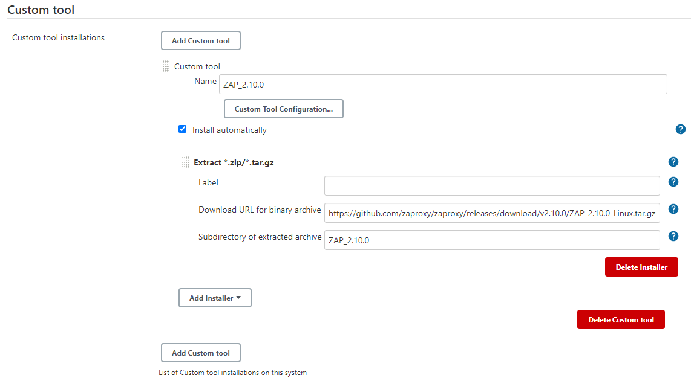
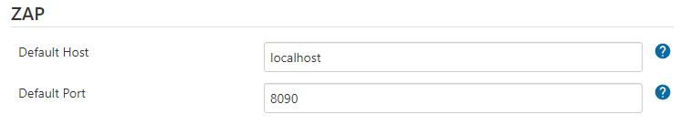
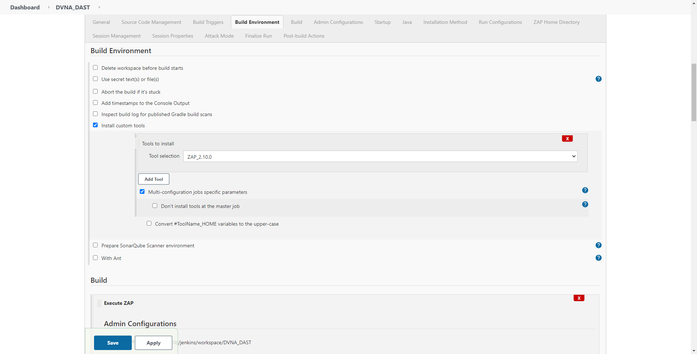

# Dynamic Application Security Testing (DAST)

## Objective

This section aims to accomplish the objective listed as 8th point of [`Task 2`](../problem-statement/#task-2) under the [Problem Statement](../problem-statement).

## What is DAST?

DAST is a method of black-box testing, which involves examining the application and its execution to find vulnerabilities externally. The source code is not available, only access to the application in its running state is provided. The tools used for DAST have generally automated testing suites. 

## Tools used for DAST

Implementation of the following tools was done using a new `Freestyle Project` in Jenkins as the current project was a `Pipeline` project and had no build phase which was required for correct implementation of DAST tools.

### [OWASP® Zed Attack Proxy (ZAP)](https://www.zaproxy.org/){target="_blank"}

ZAP is an open-source web application security scanner. It is one of the most active projects from OWASP and has been given flagship status. ZAP uses its spider to crawl through the application and scans all the discovered pages automatically, which are later attacked using the active scanner to perform the initial assessment of the application.

ZAP scans an application using two methods: active scanning and passive scanning. Active scanning attempts to find potential vulnerabilities by using known attacks against the selected targets by using a predefined set of rules (policies). Passive scanning works by monitoring the HTTP messages (requests and responses) exchanged with the application without any modifications. 

#### Installation

ZAP can be installed using various methods. It is available as an installer, a Linux package, a Jenkins plugin and a Docker image as well. Initially, I set it up using the installer however, I was unable to issue the scanning options in the command line. I was able to get a ZAP server up and running by using the Linux package, which contained the binary and the required files. 

To integrate ZAP with Jenkins, we need to install the Official ZAP Jenkins plugin and a custom tool plugin. I was able to follow [this guide](https://we45.com/blog/a-step-by-step-guide-to-integrate-zap-with-jenkins/){target="_blank"} and configure ZAP correctly.

I started by installing the Official ZAP Jenkins plugin, by navigating to `Manage Jenkins > Manage Plugins > Available` and searching for `Official OWASP ZAP` and installing it. We also need to install the `Custom Tools` plugin to get the ZAP archive and extract it in the environment, which can be done on the same page. After installing these plugins, we need to configure them.

##### Custom Tools

The Custom Tools plugin configuration is located at `Manage Jenkins > Global Tool Configuration`. By using the `Custom tool installations...` button, we can add the installation of ZAP. We need to provide the package URL and use the `Install automatically` option.

##### ZAP Plugin

ZAP plugin configuration is available under `Manage Jenkins > Configure System`. We need to provide the server address and port which was installed using the `Custom Tools` plugin. We will leave this to the default (`localhost` and `8090`).

Once the plugins are configured, we need to configure the ZAP scanner in the build phase of the pipeline.

##### Build configuration

We need to specify the home directory of ZAP, usually a `.ZAP` folder in the root of the user's home directory which in Jenkin's case is located at `/var/lib/jenkins/.ZAP`.

The following configuration was used to perform active scanning on our application:

- **Session management**: Persist Session, assign a name to the session.
- **Session properties**: 
    - **Context Name**: Name of the application.
    - **Include in Context**: URL of the application(s) with a trailing `.*` to include all paths.
    - **Exclude from Context**: Any URLs that are not to be included in the assessment.
    - **Alert Filters**: Alert Filters will override the risk levels of any specified alerts raised by the passive and active scanners within the given context.
    - **Authentication**: Signify if the Attacks will be authenticated or not.
- **Attack mode**:
    - **Starting Point**: The starting point from which you would like all attacks to originate.
    - **Spider Scan**: Use the Spider scan.
        - **Recurse**: All of the nodes underneath the one selected will also be scanned.
    - **AJAX Spider**: Use the AJAX Spider. We will not be using this option for our application.
    - **Active Scan**: Use the active scanner.
        - **Policy**: Policy to be used while running the scan. We will be using the `Default` policy.
        - **Recurse**: All of the nodes underneath the one selected will also be scanned.
- **Finalize Run**:
    - **Generate Report**: Generate the report for the assessment.
        - **Filename**: Name of the report file. `JENKINS_ZAP_VULNERABILITY_REPORT_${BUILD_ID}` where the `${BUILD_ID}` is a variable provided by Jenkins, signifies the build number.
        - **Format**: Select the formats you want the reports in.
- **Post-build Actions**: We will be using `Archive the Artifacts` to extract the reports generated by supplying `logs/*,reports/*` as `Files to archive`.

#### Usage

ZAP scans can be executed by building the pipeline, given that the application is running on the specified address in the Session Properties of ZAP. Due to our configuration, the generated report can be accessed in the project dashboard. The report is generated in HTML as well as XML format and is numbered the same as the build number in Jenkins. 

The initial run of ZAP took about an hour to complete. This process was optimized using [this guide](https://blog.mozilla.org/security/2013/07/10/how-to-speed-up-owasp-zap-scans/){target="_blank"}. All unnecessary and inappropriate tests were removed according to the application. The new complete scan times were under 5 minutes. 

## DAST Report analysis

The report provided by ZAP is quite comprehensive and provides details about major vulnerabilities found in the application. The report consists of vulnerabilities found by the ZAP scanner separated into categories according to their risk factor i.e. Low, Medium and High severity. 

The following is a table of vulnerabilities found by ZAP along with their risk level and the number of instances:

|Name                                                                       |Risk Level     |Number of Instances|
|---                                                                        |:-:            |:-:                |
|CSP: Wildcard Directive                                                    |Medium         |2                  |
|Vulnerable JS Library                                                      |Medium         |1                  |
|X-Frame-Options Header Not Set                                             |Medium         |4                  |
|Absence of Anti-CSRF Tokens                                                |Low            |3                  |
|Cookie Without SameSite Attribute                                          |Low            |2                  |
|Cross-Domain JavaScript Source File Inclusion                              |Low            |12                 |
|Server Leaks Information via "X-Powered-By" HTTP Response Header Field(s)  |Low            |26                 |
|X-Content-Type-Options Header Missing                                      |Low            |7                  |
|Information Disclosure - Suspicious Comments                               |Informational  |2                  |

Each alert is listed descriptively along with the URL, solution, references, CWE Id etc. This allows developers to track down and fix the vulnerabilities easily.

The complete report can be accessed [here](reports/ZAP_Scanning_Report.html){target="_blank"}.