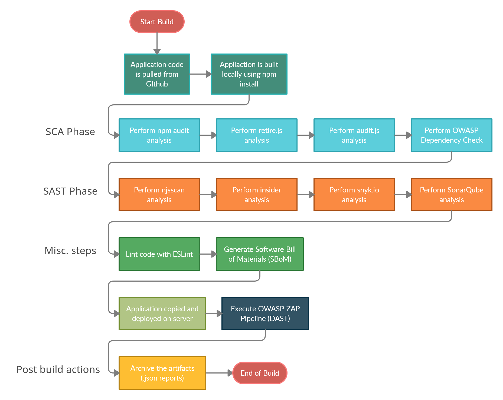

# Final Pipeline Structure

## Objective

This section will describe the final structure of our Jenkins pipeline, including the steps taken for various tests over multiple stages.

## Pipeline flow



## Jenkinsfile

The final structure of our `jenkisfile` is as follows:

```
pipeline {
    agent any
    stages {
        stage ('Building the application') {
            steps {
                sh 'npm install'
            }
        }

        stage ('Performing NPM audit') {
            steps {
                sh '''
                    npm-audit-ci-wrapper --json > ~/reports/npm-audit.json
                '''
            }
        }

        stage ('Performing retire.js analysis') {
            steps {
                sh 'bash ~/scripts/retirejs.sh'
            }
        }

        stage ('Performing audit.js analysis') {
            steps{
                withCredentials([string(credentialsId: 'OSSI_API_KEY', variable: 'OSSI_API_KEY'), string(credentialsId: 'OSSI_USERNAME', variable: 'OSSI_USERNAME')]) {
                    sh 'bash ~/scripts/auditjs.sh'
                }  
            }
        }

        stage ('Performing OWASP Dependency Check') {
            steps {
                dependencyCheck additionalArguments: '--format JSON dependency-check-report.json', odcInstallation: 'DVNA'
                sh 'mv dependency-check-report.json ~/reports/'                
            }
        }

        stage ('Performing njsscan analysis') {
            steps {
                sh 'bash ~/scripts/njsscan.sh'
            }
        }

        stage ('Performing insider analysis') {
            steps {
                sh 'bash ~/scripts/insider.sh'
            }
        }

        stage ('Performing snyk.io analysis') {
            steps{
                withCredentials([string(credentialsId: 'SNYK_API_KEY', variable: 'SNYK_API_KEY')]) {
                    sh 'bash ~/scripts/snyk.sh'
                }  
            }
        }

        stage ('Performing SonarQube analysis') {
            environment {
                scannerHome = tool 'SonarQubeScanner'
            }

            steps {
                withSonarQubeEnv ('SonarQube') {
                    sh '${scannerHome}/bin/sonar-scanner -Dsonar.projectKey="DVNA" -Dsonar.projectBaseDir="/var/lib/jenkins/workspace/DVNA"'
                }
            }
        }

        stage ('Linting code with ESLint') {
            steps {
                sh 'bash ~/scripts/eslint.sh'
            }
        }

        stage ('Generating SBoM') {
            steps {
                sh 'cyclonedx-bom -o ~/reports/sbom.json'
            }
        }

        stage ('Deploying the application') {
            environment{
                MYSQL_USER = credentials('MYSQL_USER')
                MYSQL_DATABASE = credentials('MYSQL_DATABASE')
                MYSQL_PASSWORD = credentials('MYSQL_PASSWORD')
                MYSQL_HOST = credentials('MYSQL_HOST')
                MYSQL_PORT = credentials('MYSQL_PORT')
                APPLICATION_SERVER_IP = credentials('APPLICATION_SERVER_IP')
                APPLICATION_SERVER_USERNAME = credentials('APPLICATION_SERVER_USERNAME')
            }

            steps {
                sh '''
                    ssh ${APPLICATION_SERVER_USERNAME}@${APPLICATION_SERVER_IP} "cd dvna && pm2 resurrect && pm2 stop DVNA && pm2 delete DVNA"
                    ssh ${APPLICATION_SERVER_USERNAME}@${APPLICATION_SERVER_IP} "rm -rf dvna && mkdir dvna"
                    scp -r * ${APPLICATION_SERVER_USERNAME}@${APPLICATION_SERVER_IP}:~/dvna
                    ssh -T ${APPLICATION_SERVER_USERNAME}@${APPLICATION_SERVER_IP} "cd dvna && MYSQL_USER=${MYSQL_USER} MYSQL_DATABASE=${MYSQL_DATABASE} MYSQL_PASSWORD=${MYSQL_PASSWORD} MYSQL_HOST=${MYSQL_HOST} MYSQL_PORT=${MYSQL_PORT} pm2 start --name=DVNA npm -- start && pm2 save"
                '''
            }
        }

        stage ('DAST Using OWASP ZAP') {
            steps {
                build job: 'DVNA_DAST', propagate: true, wait: true
            }
        }
    }

    post {
        always {
            dir('/var/lib/jenkins/reports/') {
                    archiveArtifacts artifacts: '*.json', fingerprint: true
            }
        }
    }
}
```