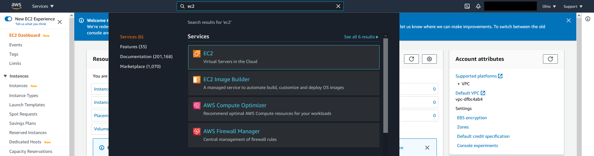
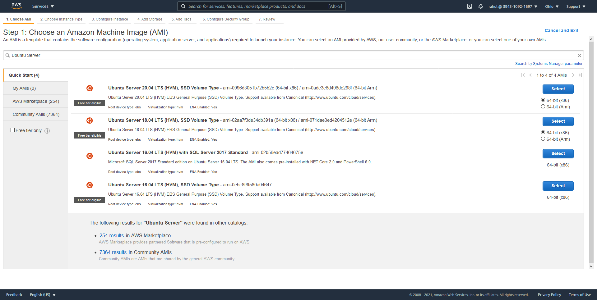
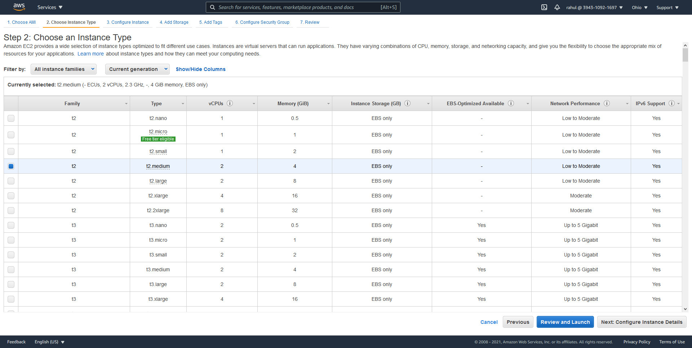
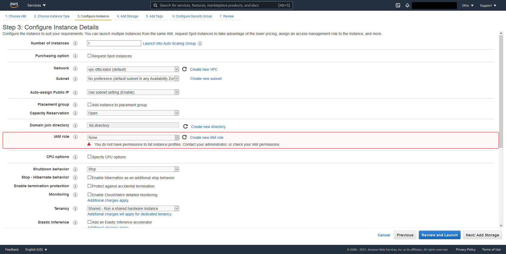
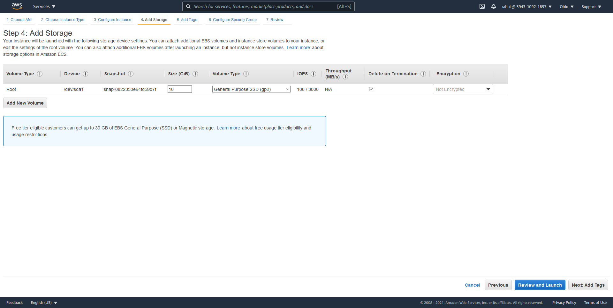
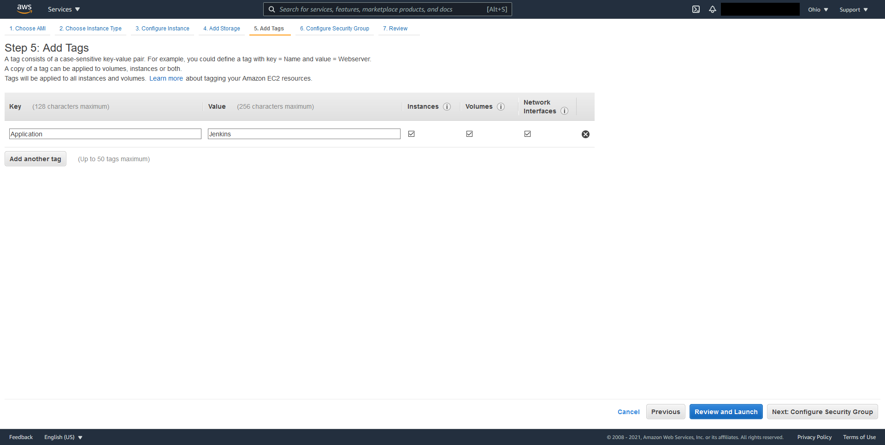
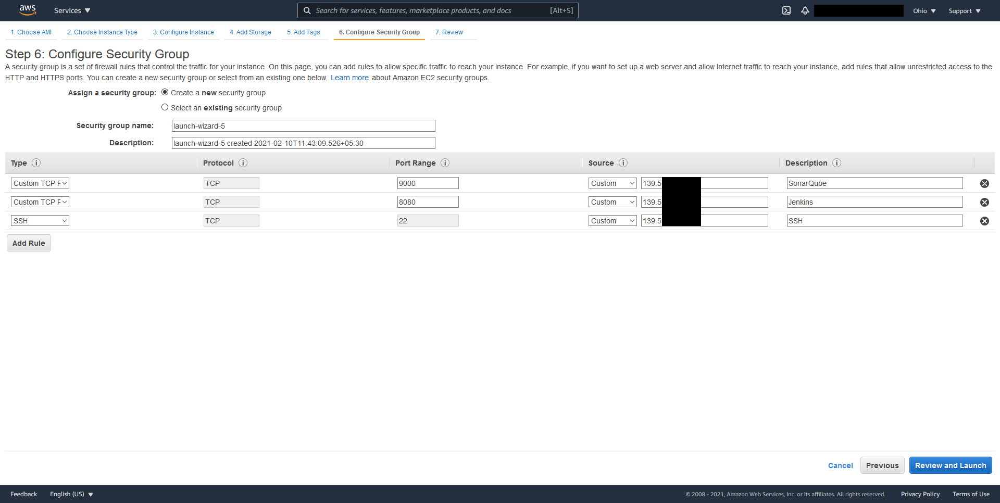
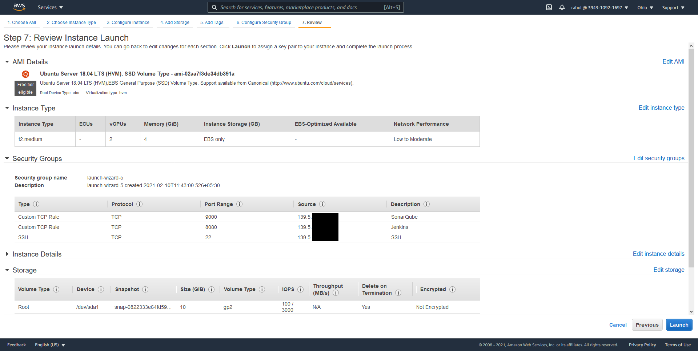
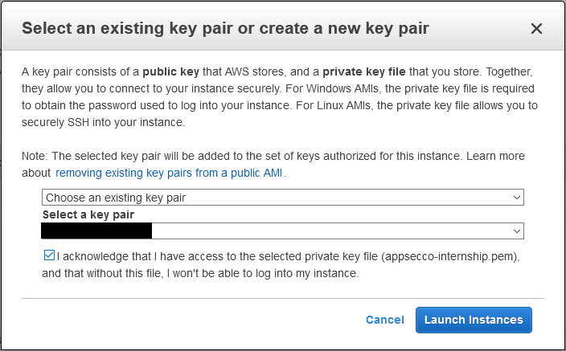

# Migrating to AWS

## Objective

In this section, we will be migrating our local VM setup to the cloud on AWS using various services as per [`Task 3`](../problem-statement/#task-3) listed under the [Problem Statement](../problem-statement).

We will be discussing the details about our cloud platform, steps taken to transfer the local setup to the cloud and configure a new application deployment method along with database setup and secrets management in the following section.

## About AWS

Amazon Web Services (AWS) is one of the major cloud providers. They have worldwide servers with a comprehensive catalog of services. We will be using these services to run our Jenkins machine and the application server in the cloud.

## Instance setup

### Jenkins server

We will be using Elastic Compute 2 (EC2) service on AWS to deploy our Jenkins server. EC2 provides virtual servers in the cloud that can be configured according to our hardware and software requirements. 

We will navigate to the EC2 dashboard using the search bar in our AWS portal to launch an instance.



We can proceed to launch a new instance by clicking the orange `Launch Instance` button in the EC2 dashboard. 

Since our VMs were running on Ubuntu Server 18.04, we will proceed with the same in AMI (Amazon Machine Images) selection.



We will be launching a `t2.medium` instance, which is equipped with 2 CPU cores and 4 GB RAM, sufficient for running Jenkins and various tools.

**Note: **The instance was later upgraded to a `t2.large` size as the RAM requirements increased with the inclusion of various new tools.



We will continue with the default settings for Instance Details as there are no changes required for us here.



The instance storage will be increased to 10GB as it is the minimum [recommended](https://www.jenkins.io/doc/book/scaling/hardware-recommendations/){target="_blank"} amount and will allow us to store various applications, scripts and maintain logs and artifacts.



We will add the application type tag to our instance, which will allow us to locate the specific instance easily.



We will be limiting access to the Jenkins dashboard, SonarQube dashboard, and SSH to our IP address in the security group configuration. The current IP address will be automatically picked up by using `My IP` option.

**Note:** Make sure you have a static IP address before setting specific IP access. The dynamic IP address would require you to change your IP address in the security group every time your IP address changes.



Now we can review the final configuration of our instance. Once we have an overview of the settings, we can deploy the instance using the `Launch` button.



Upon launching the instance, we are asked to either create a new key pair or use an existing one. This key will be used to access the instance using SSH.

**Note:** While using an existing key, make sure you have access to the file as AWS allows downloading the file only once at the time of generation.



Once the instance is up and running, the details such as IP address can be accessed from the EC2 dashboard by navigating to the `Running Instances` page. We can also manage and monitor our instance from here. 

Once we SSH to our instance, we can proceed to set up Jenkins by following the steps in [Installing Jenkins](../setting-up-vms/#installing-jenkins) and creating our pipeline using the same steps as [Pipeline Setup](../pipeline-setup).

**Note:** The default user for SSH is `ubuntu.`

We will be re-installing our complete toolset for various stages (SCA, SAST, etc.). All the scripts created for the tools will be copied over from our local VM and uploaded to our instance via SFTP.

#### SCA Tools

##### npm-audit

npm audit was installed by following the same steps as mentioned in the [VM installation](../software-composition-analysis/#installation).

##### retire.js

retire.js was installed by following the same steps as mentioned in the [VM installation](../software-composition-analysis/#installation_1).

##### OWASP Dependency Check

OWASP Dependency Check was installed by following the same steps as mentioned in the [VM installation](../software-composition-analysis/#installation_2).

**Note:** While running the pipeline, Dependency Check was unable to locate the `yarn audit` command as per the logs, which had to be installed manually using `npm install yarn -g.`

##### audit.js

audit.js was installed by following the same steps as mentioned in the [VM installation](../software-composition-analysis/#installation_3).

#### SAST Tools

##### njsscan

njsscan was installed by following the same steps as mentioned in the [VM installation](../static-analysis/#installation).

##### insider

insider was installed by following the same steps as mentioned in the [VM installation](../software-composition-analysis/#installation_1).

##### snyk.io

snyk.io was installed by following the same steps as mentioned in the [VM installation](../software-composition-analysis/#installation_2). The API key was set as a secret in Jenkins.

##### SonarQube Scanner

SonarQube Scanner was installed by following the same steps as mentioned in the [VM installation](../software-composition-analysis/#installation_3). The token was set as a Jenkins secret.

The SonarQube server was set to launch at boot by adding the following command to `crontab -e`:

```
@reboot bash /var/lib/jenkins/scripts/sonarqube/bin/linux_x86/sonar.sh start
```

#### DAST Tools

The DAST phase consists of a single tool, OWASP ZAP. The tool was installed and configured using the same steps as mentioned in [installation steps](../dynamic-analysis/#installation). A separate `freestyle project` was set up to run the tool.

#### ESLint (Code Linting)

ESLint was installed by following the same steps as mentioned in the [VM installation](../code-linting/#installation). The initial config command was executed in the root directory of DVNA.

#### CycloneDX (SBoM)

CycloneDX was installed by following the same steps as mentioned in the [VM installation](../software-bill-of-materials/#installation).

### Application server

For the application server, we will follow the same steps as we followed for the Jenkins instance except for a few minor changes :

- We will launch a `t2.micro` instance with 1 CPU core and 1 GB of RAM, which should be sufficient for running a lightweight node application.

- In the network VPC, we will allow SSH access only from the IP of our Jenkins instance and open port 9090 to my IP as that is the application access point.

The rest of the configuration, such as the MySQL database and SSH access, was done according to steps followed in [Configuring the application VM](../setting-up-vms/#configuring-the-application-vm).

## Deploying using Amazon ECS

Amazon Elastic Container Service (Amazon ECS) is a container management service that allows us to run containers on a cluster. Running our application on ECS saves cost, provides better compatibility and more security as compared to running the same application on an EC2 instance. ECS provides an efficient configuration for using and managing available resources.

To deploy our application on ECS, we need to build a Docker image of our application, push it to a registry and define a task under a service which will deploy the container after pulling it from the registry.

### Building the docker image

DVNA comes with a `dockerfile` which contains all the information required to convert it into an image. The `dockerfile` contains the requirements of the application, such as node.js and lists the steps to be executed in order to get the application up and running. Steps for deploying DVNA using Docker have been listed in the application's [readme](https://github.com/appsecco/dvna#using-official-docker-image){target="_blank"}.

To build an image we can use the following command:

```
docker build -t username/dvna .
```

Once the build is successful, we can list all available docker images by using `docker images`.

### Configuring ECR (Elastic Container Registry)

ECR is a container registry which allows us to easily store, manage, share and deploy container images. This eliminates the need for third-party repositories for maintaining our container images. We will be creating a new registry for our application. 

Once the registry is created, we can use the show push commands button to get a list of steps that we can follow to push our image to the repository.

To authenticate with the repository via CLI, we need to configure AWS CLI. 

#### Configuring AWS CLI

AWS CLI is a tool which allows us to access and manage AWS services via the command line. We will be using AWS CLI to authenticate ourselves with the ECR and later automate the ECS deployments. 

##### Installation

AWS CLI can be installed either by following the official documentation, or by using the following command:

```
sudo apt install awscli
```

**Note:** This command will work only if your distribution's package repository contains awscli. If the package is not found, please follow the manual installation method mentioned in the official documentation [here](https://docs.aws.amazon.com/cli/latest/userguide/cli-chap-install.html){target="_blank"}.

##### Usage

To authenticate our AWS account using the CLI, we need to run the command:

```
aws configure
```

This command will prompt us to input our AWS Access Key ID and Secret Access Key. These details are generally provided along with your AWS IAM account details.

Once we are authenticated via AWS CLI, we can proceed to follow the push commands provided by ECR.

**Note:** Please make sure the correct region is specified while using `aws configure` and creating a repository. ECR and ECS items can only be accessed in the region they are deployed.

### Task definition

A task definition in ECS is required to run the container image. It is the configuration of our container deployment and contains various details such as the image to be deployed, resources such as CPU and RAM to be allocated, type of infrastructure etc.

### Cluster creation

A cluster is a logical grouping of tasks or services. A cluster allows us to group services and tasks related to a specific application for easier identification and management.

### Service creation

A service in ECS allows us to run and maintain multiple deployments of a task definition simultaneously in a cluster.

**Note :** While running the service for the first time, the deployment failed and container logs showed the error 'Unable to find host' which was caused due to the missing MySQL environment variables. After adding the required environment variables related to the MySQL database in the task settings, the container deployed successfully.

### Final deployment steps

The flow of our ECS deployment will be :

Jenkins finishes various scans and runs the deployment script -> Application code is cloned from Github repository -> A new image is built of the application -> The image is pushed to ECR -> The running task is stopped -> A new task is automatically started by the service -> Older images and files are cleaned

All these steps will be carried out using a shell script. The contents of the shell script are as follows:

```
#!/bin/bash

# Clone application from Github repository
git clone https://github.com/nxious/dvna
cd dvna

# Logging into ECR
aws ecr get-login-password --region us-east-2 | docker login --username AWS --password-stdin XXXXXXXXXXXX.dkr.ecr.us-east-2.amazonaws.com

# Building the application image
docker build -t dvna .

# Tagging the image
docker tag dvna:latest XXXXXXXXXXXX.dkr.ecr.us-east-2.amazonaws.com/dvna:latest

# Push image to ECR
docker push XXXXXXXXXXXX.dkr.ecr.us-east-2.amazonaws.com/dvna:latest

# List currently running tasks
#task=$(aws ecs list-tasks --cluster default --output json | jq -r .taskArns[0])
task=$(aws ecs list-tasks --cluster "default" --service "DeployDVNA" --output text --query taskArns[0])

# Stop running tasks
aws ecs stop-task --cluster default --task "$task" &> /dev/null
```

This script was stored along with rest of the scripts and added to the jenkinsfile as a replacement for the earlier EC2 deployment stage:

```
stage ('Deploying the application') {
    steps{
        sh '''
            bash ~/scripts/deploy_dvna_ecs.sh 
            rm -rf ./*
        '''
    }
}
```

## Database Setup

Since our application uses a MySQL database for storing information, we can use Amazon RDS (Relational Database Service) to host our database as a separate entity. 

We can access the RDS Dashboard by navigation to the AWS Management Console and searching for RDS in the search bar. The RDS Dashboard will allow us to create a DB instance based on MySQL which we will use for our application.


Since our application is small scale and the database requirements are minimal, we will be deploying a db.t2.micro size instance which comes with 1GiB RAM and 1 vCPU.

In order to access this instance from our ECS deployment, we need to have both services running under the same VPC. The endpoint is not public and can only be accessed from machines within the VPC.

To create our database for DVNA, we will proceed by clicking the orange `Create database` button in the RDS dashboard. We will be using the standard create procedure as it will allow us to access some advance options for creating the database. The engine we will be using is MySQL 8.0.20 which will be created using the Free Tier template. The database was named `dvna` and the credentials were set. Rest of the configuration remained untouched except the Connectivity part, where the VPC containing our ECS instance was selected and public access was turned off.

Once the RDS instance is up and running, the endpoint can be obtained by navigating to the `Connectivity & security` section of the database instance. We can test the access by using the following command in our EC2 instance or the ECS deployment:

```
mysql -u root -h dvna.XXXXXXXXXXXX.us-east-2.rds.amazonaws.com -p
```

We can now use the database details in our deployments which need to be passed as environment variables.

## Secrets Management

We will be using a secrets management service in order to securely store any credentials such as usernames, passwords and API keys and pass them straight to the point where they will be used. This service we will be using for our ECS deployments is Parameter Store and is a provided as a feature of AWS Systems Manager. 

We can access Parameter Store dashboard by either navigating to the Systems Manager and selecting Parameter Store on the left sidebar under Application Management or by directly searching for it using the search bar on the top.

Each secret can either be stored individually or in a hierarchical structure. We will be creating five secrets for our application's database, namely the database name, username, port, password and the endpoint (URL for accessing the database). These secrets will be stored as parameter values, and henceforth be known as parameters. 

To create a new parameter, we can use the orange `Create parameter` button on the Parameter Store dashboard. Here we can define the name, description, type, data type and value of the parameter we wish to store. We will be creating the parameters under the `/production` base as we are deploying the production version of the application. Once we have created the parameter, we can pass them as environment variables to our ECS Task by passing the ARN of the secret as the value.


Here, each parameter can be accessed as a secret. The `DVNA_RDS_DB` parameter contains a value while `DVNA_RDS_DB/password` will contain another value being the child of the parent parameter.

Each of the parameters are associated with a unique ARN (Amazon Resource Name), which can be used to access the specific resource. This ARN can be obtained thru awscli by using the command:

```
aws ssm get-parameters --names "ParameterName"
```

The ARNs can now be passed as a `ValueFrom` type in the environment variables of the container. 


**Note: ** While running ECS task for the first time after defining the parameters, the environment variables were not set as the access to parameters was denied. This was due to the Parameter Store roles being assigned to my personal IAM role instead of `ecsTaskExecutionRole`, which is the role used on my behalf while running the ECS tasks. This was fixed by assigning the Parameter Store permissions to the `ecsTaskExecutionRole`.

**Note: ** Upon defining the Parameter Store secrets as environment variables and running the ECS task, the logs indicated a `Client does not support authentication protocol requested by server; consider upgrading MySQL client` error which was the [same error](/setting-up-vms/#configuring-the-application-vm) I faced while deploying the database for first time in the VM. This was resolved by using the same method mention [here](https://stackoverflow.com/questions/50093144/mysql-8-0-client-does-not-support-authentication-protocol-requested-by-server){target="_blank}.

**Note: ** While defining environment variables in the container definition of a task, the environment variables can either be passed as a `Value` or `ValueFrom` type, the difference being that `Value` type will pass the actual value defined whereas the `ValueFrom` type will fetch the value from the passed AWS ARN. A single environment variable being set as `Value` type was preventing my application from being deployed successfully. This was resolved by creating a new revision of the task definition and changing the environment variable type from `Value` to `ValueFrom`.