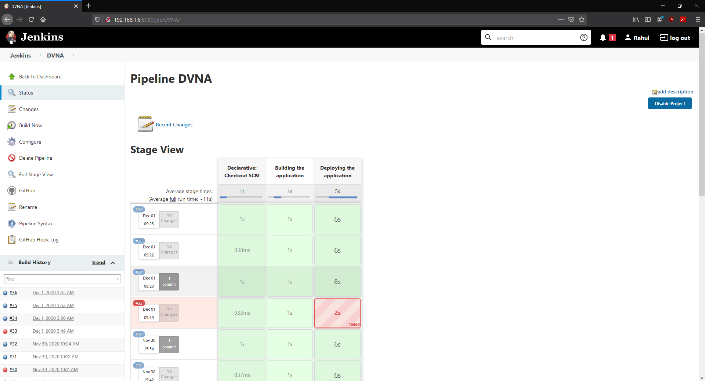

# Jenkins Pipeline Setup

## Objective

This section aims to accomplish the objective listed as 3<sup>rd</sup> point of [`Task 2`](../problem-statement/#task-2) under the [Problem Statement](../problem-statement).

We will be discussing the details, configuration and structure of a Jenkins pipeline in the following section.

## What is a Pipeline?

In Jenkins, a pipeline is a group of events or jobs which are interlinked with one another in a sequence. These sequences help us automate the building, testing and deployment of the application.

## Setting up the Jenkins pipeline

We have already setup Jenkins on a VM in the previous section. Now we will be using Jenkins to build a pipeline which will be responsible for fetching the latest application code from Github, building it and then copying it over to the application VM and deploying it.

Jenkins provides a friendly web-interface to achieve all this. Equipped with the official pipelining building [guide](https://www.jenkins.io/doc/pipeline/tour/hello-world/){target="_blank"}, I took the following steps in order to set up the pipeline:

### General

- Make a new pipeline project by clicking on `New Item` on the left side menu.
- Enter the name of the project, which in my case is `DVNA`.
- Check the `Discard old builds` option, as we do not have a use for previous builds.
- Check the `Github Project` option and provide the URL for the project as we will be fetching code from Github.

### Build triggers

- Check the `GitHub hook trigger for GITScm Polling` option as it allows us to trigger builds automatically using GitHub hooks. We can set the condition upon which a new build will be triggered.

### Pipeline

- From the Definition dropdown, select the `Pipeline script from SCM` option as we will be using a `jenkinsfile`, a script which is used to orchestrate the build process. This file will be included in the root directory of our application repository on GitHub.

## Configuring jenkinsfile

The `jenkinsfile` is a script that contains the definition of how the Jenkins Pipeline will function. It allows us to define the various steps and actions that will be taken by Jenkins in order to work with our application spread over various stages. I went with a 2-stage approach, covering the building followed by deployment of the application. The application will be built on the Jenkins machine and then will be copied over to the application VM to be deployed.

The structure of my `jenkinsfile` is as follows:

```
pipeline {
    agent any
    stages {
        stage ('Building the application') {
            steps {
                sh 'npm install'
            }
        }

        stage ('Deploying the application') {
            environment{
                MYSQL_USER = 'root'
                MYSQL_DATABASE = 'dvna'
                MYSQL_PASSWORD = 'passw0rd'
                MYSQL_HOST = '127.0.0.1'
                MYSQL_PORT = '3306'
            }

            steps {
                sh '''
                    ssh common@192.168.1.7 "cd dvna && pm2 stop DVNA"
                    ssh common@192.168.1.7 "rm -rf dvna && mkdir dvna"
                    rsync -r * common@192.168.1.7:~/dvna
                    ssh -T common@192.168.1.7 "cd dvna && MYSQL_USER=${MYSQL_USER} MYSQL_DATABASE=${MYSQL_DATABASE} MYSQL_PASSWORD=${MYSQL_PASSWORD} MYSQL_HOST=${MYSQL_HOST} MYSQL_PORT=${MYSQL_PORT} pm2 start --name=DVNA npm -- start && pm2 save"
                '''
            }
        }
    }
}
```
**Note: ** While using individual shell commands, make sure that you keep a track of the directories. Each SSH command will set the `PWD` to the root of the home directory of the user. My earlier approach consisted of single line sh commands to remove old build, copy new build and then execute it. I face the error where my app was not found by node as I was not in the correct directory.

We will be using [`pm2`](https://pm2.keymetrics.io/){target="_blank"} which is a process manager for Node.js. It will allow us to run the application in the background and start/stop the application easily.

**Note: **pm2 won't be able to find the app after rebooting the VM. To prevent this, we will use the `pm2 save` command which will save the state of running apps before rebooting. We can reload the processes using `pm2 resurrect` which we will combine with `pm2 delete` in order to stop multiple active instances of the same application.

The application required environment variables setup for it to function properly. These were passed directly to the node application in the last step.

To prevent accidental exposure of credentials via the `jenkinsfile`, I have used a feature of Jenkins known as `Secrets`. This allows us to define credentials in the Jenkins dashboard and use them wherever we need using the `credentials(ID)` function. The credentials show up masked as `****` in the logs as well. These secrets can be defined by navigating to `Manage Credentials` option under the `Manage Jenkins` setting. We can add various types of secrets and use them in the `jenkinsfile` under the `environment{}` block.

**Note: ** There are many other ways to pass environment variables to the application server, however the method above worked best for my situation. You can use Jenkins plugins, shell scripts etc. depending upon your use case and purpose.

Once all this is done, we can commit the `jenkinsfile` to our repository and hit `Build Now` in the Jenkins control panel.



If the build is successful, we can access our app using the IP of the application VM.


We can check logs to see how our commands were executed and what was their output. The logs also help us in debugging the pipeline.