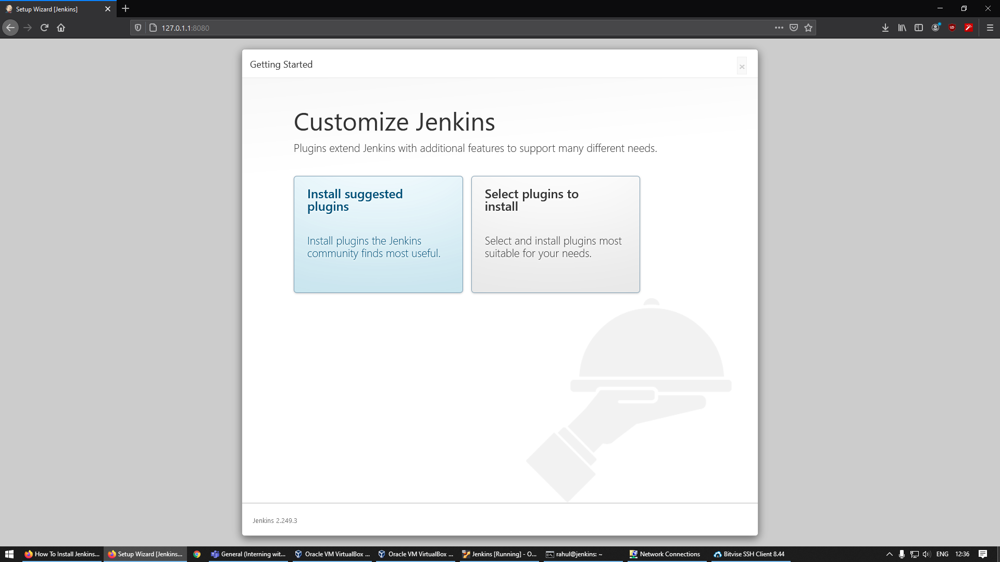
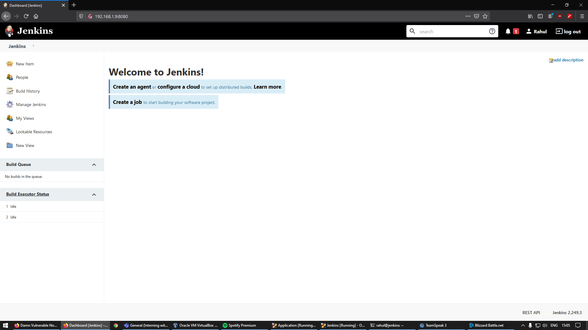
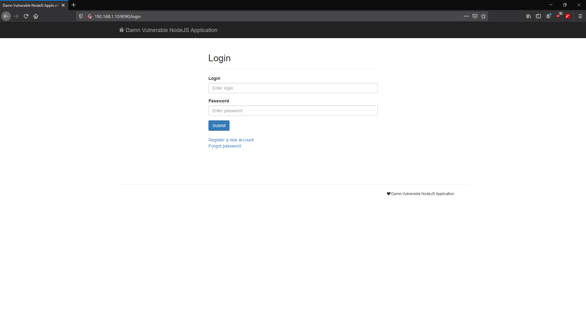

# Setting up Virtual Machines

## Objective

This section aims to accomplish the objectives listed as 1st and 2nd point of [`Task 1`](../problem-statement/#task-1) under the [Problem Statement](../problem-statement).

## System Configuration

The project requires setting up two virtual machines using Ubuntu 18.04 LTS as the operating system. [VirtualBox](https://www.virtualbox.org/){target="_blank"} was used  

The installation was performed using the following guide : [Ubuntu 18.04 Virtual Machine Setup](https://codebots.com/library/techies/ubuntu-18-04-virtual-machine-setup){target="_blank"}

The guide was sufficient and covered all the required steps including installation of the OpenSSH server. 

**Note: ** The network adapters were set to Bridged mode in order to allow independent IP assignment on my router itself. This allows me to access the servers via SSH and via a browser on the host machine and allows the Virtual Machines to act as real machines from a network point of view.

## Installing Jenkins

Jenkins is the leading open-source automation server. We will be using this tool to build our Continuos Integration (CI) pipeline for an application.

To install Jenkins on Ubuntu Server 18.04, I followed the official guide for Linux listed on Jenkin's website which can be found [here](https://www.jenkins.io/doc/book/installing/linux/#debianubuntu){target="_blank"}.



I proceeded with the `Install suggested plugins` option as guided by my mentors. 

**Note: ** Upon trying for the first time, some core plugins failed to install due to issues in the VM. I resolved all the errors by rebuilding the VM and switching to the weekly release instead of the LTS release.

After the setup was complete and the plugins finished installing, I was greeted by the Jenkins dashboard:



## Choosing the application

The application that I have chosen for my pipeline is [DVNA (Damn Vulnerable Node Application)](https://github.com/appsecco/dvna){target="_blank"}. It is a simple NodeJS application to demonstrate OWASP Top 10 Vulnerabilities and guide on fixing and avoiding these vulnerabilities. 

## Configuring the application VM

To deploy the application (DVNA), I followed the guide included in the Github readme which can be found [here](https://github.com/appsecco/dvna#manual-setup){target="_blank"}. I used my personal fork of the application so that I can make changes to the application in the future.

The application requires a MySQL server for which I followed DigitalOcean's guide which can be found [here](https://www.digitalocean.com/community/tutorials/how-to-install-mysql-on-ubuntu-18-04){target="_blank"}.

For launching the application, MySQL configuration needs to be performed. The application's guide tells us to define the following system variables containing the database information:

```
export MYSQL_USER=dvna
export MYSQL_DATABASE=dvna
export MYSQL_PASSWORD=passw0rd
export MYSQL_HOST=127.0.0.1
export MYSQL_PORT=3306
```

If we use the export command, the variables will reset after every reboot. To avoid this, I moved the commands to a bash script which runs before the application and exports the environment variables called `env.sh`.

Once all the configuration is completed, we can launch the app using `npm start` and access the application by visiting `http://VM-IP:9000` in a browser:



**Note: **While running the application for the first time with `npm start`, I faced the error `Client does not support authentication protocol requested by server; consider upgrading MySQL client`. I found the solution for this on StackOverflow which can be located [here](https://stackoverflow.com/questions/50093144/mysql-8-0-client-does-not-support-authentication-protocol-requested-by-server){target="_blank"}. 

## Setting up SSH access

I setup SSH access to the application server from the `jenkins` user on the Jenkins server. This was done in order to allow Jenkins to issue commands to the application server while deploying the application. This was done using the guide [here](https://www.tecmint.com/ssh-passwordless-login-using-ssh-keygen-in-5-easy-steps/){target="_blank"}.

Once the public key was setup on the application server, SSH was possible without providing any passwords or keys. The configuration automatically handles the key exchanges.