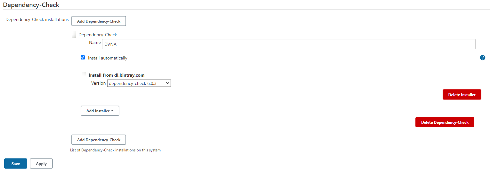

# Software Composition Analysis (SCA)

## Objective

This section aims to accomplish the objective listed as 4th point of [`Task 1`](../problem-statement/#task-1) under the [Problem Statement](../problem-statement).

## What is SCA?

Software Composition Analysis (SCA) is a segment of the application security testing (AST) tool group that deals with managing open source component use. SCA tools perform automated scans of an application’s code base, including related artifacts such as containers and registries, to identify all open source components, their license compliance data, and any security vulnerabilities.

## Tools used for SCA

Each tool used was added as a new stage in the `jenkinsfile`. 

### [npm-audit](https://docs.npmjs.com/cli/v6/commands/npm-audit){target="_blank}

`npm-audit` is an inbuilt feature of the Node Package Manager (`npm`) since version 6 and is responsible for performing a security review of the project’s dependency tree. Audit reports generated by `npm-audit` contain information about security vulnerabilities in the project's dependencies.

#### Installation

Since `npm-audit` is paired with npm, there is no need to install anything. However if you're using an older version of `npm` (Can be checked using the `npm -v` command), you can upgrade to the latest version by using the following command :

```
sudo npm install -g npm@latest
```

**Note: **The `-g` flag in `npm` specifies that the installation of the package is global.

#### Usage

To use `npm audit` in a Jenkins environment, I went with [`npm-audit-ci-wrapper`](https://www.npmjs.com/package/npm-audit-ci-wrapper){target="_blank"} which performs the function of `npm audit` without interrupting the Jenkins flow with an error code.  

The report is generated in the `JSON` format and saved inside the `~/reports` folder.

The final `npm audit` stage looked like this:

```
stage ('Performing NPM audit') {
    steps {
            sh '''
                npm-audit-ci-wrapper --json > ~/reports/npm-audit.json
            '''
    }
}
```

**Note: **Upon the first execution of `npm-audit`, the `EAUDITNOPJSON` and `EAUDITNOLOCK` might occur due to missing `package-lock.json` file. These errors can be resolved by generating the said file using the command `npm i --package-lock-only`. More information on this can be found [here](https://docs.npmjs.com/auditing-package-dependencies-for-security-vulnerabilities#resolving-eauditnopjson-and-eauditnolock-errors){target="_blank}

### [retire.js](https://retirejs.github.io/retire.js/){target="_blank"}

`retire.js` aims at the detection of JavaScript libraries and modules containing known vulnerabilities. It scans the packages used by the application to check if any of them are containing known vulnerabilities. Complete list of all the vulnerabilities detected by Retire.js can be found on the [retire.js website](https://retirejs.github.io/retire.js/){target="_blank"}.

#### Installation

`retire.js` is available in many forms as extensions and plugins, however the most convenient method for me was to use it as an `npm` module. To install it, we will be using the following command :

```
npm install -g retire
```

#### Usage

`retire.js` can be invoked using the `retire` command as we installed it globally. Initially I added the entier command to the `jenkinsfile` to be executed. However the pipeline was interrupted as the `retire` command gave a non-zero exit code upon execution. I decided to use a shell script to control the exit code. This script was placed inside a folder named `scripts` in the Jenkins home directory .

Contents of `retirejs.sh` are as follows:

```
#!/bin/bash

cd ~/workspace/DVNA/
retire --outputformat json  --outputpath ~/reports/retire.json
exit 0
```

This script executes the `retire` module and outputs the report to the `~/reports` folder in the `JSON` format.

This script was implemented as a stage in the `jenkinsfile`:

```
stage ('Performing retire.js audit') {
    steps {
        sh 'bash ~/scripts/retirejs.sh'
    }
}
```

**Note: **At a later point of time, I came across the flag `--exitwith <code>` which is an option of the `retire` command. One can use the `retire` command directly in the `jenkinsfile` by adding the flag. I chose to stick with the shell-script approach as it was working fine for me.

### [OWASP Dependecy Check](https://owasp.org/www-project-dependency-check/){target="_blank"}

Dependency-Check is a Software Composition Analysis (SCA) tool that attempts to detect publicly disclosed vulnerabilities contained within a project’s dependencies. Dependency-Check uses a variety of analyzers to build a list of Common Platform Enumeration (CPE) entries for the dependencies used in the project. If any CPEs are found, it generates a report containing the CVEs related to the same.

#### Installation

Dependency-Check is available as a plugin for various applications, Jenkins being one of them. The plugin can be installed by visiting `Manage Jenkins > Manage Plugins > Available`, where we can search for [`OWASP Dependency-check`](https://plugins.jenkins.io/dependency-check-jenkins-plugin/){target="_blank"} and install the plugin.

We need to configure the plugin by visiting `Manage Jenkins > Global Tool Configuration > Dependency-Check`, and add a Dependency-Check installation. We need to define a name, choose if we want automatic installation which fetches the latest binaries required for the plugin to work automatically. We can also use the manual option if we need to use specific versions of Dependency-Check.



After the configuration is done, we click on `Apply` and save our settings.

#### Usage

Since we are using a Jenkins plugin, the syntax to use the plugin is available in the `Pipeline Syntax` section of the project page. We can use the given dropdown menu to select `dependencyCheck: Invoke Dependency-Check` and generate the `jenkinsfile` syntax by clicking the `Generate Pipeline Script` button. I supplied the additional arguments and got the following script:

```
dependencyCheck additionalArguments: '--format JSON dependency-check-report.json', odcInstallation: 'DVNA'
```

This script can be used directly in the `jenkinsfile` as part of a stage. It will invoke the Dependency-Check, using the installation `DVNA` and generate the report `dependency-check-report` in `JSON` format.

The stage in `jenkinsfile` looks like this:

```
stage ('Performing OWASP Dependency Check') {
    steps {
        dependencyCheck additionalArguments: '--format JSON dependency-check-report.json', odcInstallation: 'DVNA'
        sh 'mv dependency-check-report.json ~/reports/'                
    }
}
```

Since `dependencyCheck` generates the report in the same directory as the project, I used the `mv` command to move the generated report to the correct folder.

### [audit.js](https://www.npmjs.com/package/auditjs){target="_blank"}

`auditjs` is an `npm` package that audits JavaScript projects for known vulnerabilities and outdated package version using the [OSS Index](https://ossindex.sonatype.org/){target="_blank"}. `auditjs` functions by traversing the node_modules folder in the project, so it will pick up the dependencies that are physically installed.

OSS Index is a free catalog of open source components and scanning tools to help developers identify vulnerabilities, understand risk, and keep their software safe.

#### Installation

`auditjs` is available as an `npm` package and can be installed using the following command: 

```
npm install auditjs -g
```

Once `auditjs` is installed, we need to obtain the API key from the OSS Index [website](https://ossindex.sonatype.org/user/settings){target="_blank"}. This API key is required in order to access the OSS Index database which will be used by `auditjs` and will be supplied as an argument while running `auditjs`.

#### Usage

We will be using `auditjs` with the `ossi` option which will allow us to audit the application using the Sonatype OSS Index. We also need to provide the username and the API key in the command arguments in order to authenticate with the database. The final command is:

```
auditjs ossi -u $OSSI_USERNAME -p $OSSI_API_KEY --json > ~/reports/auditjs-report.json
```

This command was placed in a script `auditjs.sh` to control the exit code and prevent interruption in the pipeline.

```
#!/bin/bash

cd ~/workspace/DVNA/
auditjs ossi -u $OSSI_USERNAME -p $OSSI_API_KEY --json > ~/reports/auditjs-report.json
exit 0
```

The `$OSSI_USERNAME` and `$OSSI_API_KEY` in the command arguments are set as environment variables whose values are provided by Jenkins secrets. To achieve this, we will be using a function `withCredentials()` provided by the Credentials Binding Plugin in Jenkins. The plugin is already installed if you went with `Install suggested plugins` while setting up Jenkins.

This function allows us to pass Jenkins secrets such as credentials, files etc. as environment variables to the OS. Combining the `auditjs` script and the `withCredentials()` function inside a stage gives us the following syntax, which is placed in the `jenkinsfile`:

```
stage ('Performind audit.js check') {
    steps{
        withCredentials([string(credentialsId: 'OSSI_API_KEY', variable: 'OSSI_API_KEY'), string(credentialsId: 'OSSI_USERNAME', variable: 'OSSI_USERNAME')]) {
            sh 'bash ~/scripts/auditjs.sh'
        }  
    }
}
```

### SCA Reports

All of the reports generated by various tools were stored in `JSON` format under the `/reports/SCA/` folder located in the default home directory of the Jenkins user (/var/lib/jenkins).