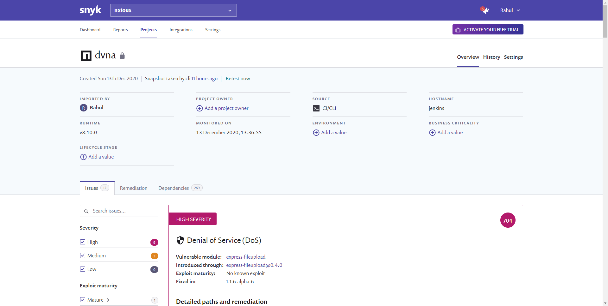

# Static Application Security Testing (SAST)

## Objective

This section aims to accomplish the objective listed as 5th point of [`Task 1`](../problem-statement/#task-1) under the [Problem Statement](../problem-statement).

## What is SAST?

SAST is testing the application source code, byte code and binaries for bugs and design errors from "inside out" before the application is deployed. It helps us detect and fix any problems that may introduce security vulnerabilities in the application.

While SCA allows us to monitor the components, SAST helps us analyze the source code of the application. Further differences between SCA and SAST are described very well in [this article](https://resources.whitesourcesoftware.com/blog-whitesource/sast-vs-sca){target="_blank"} from WhiteSource.

## Tools used for SAST

### [njsscan](https://github.com/ajinabraham/njsscan){target="_blank"}

`njsscan` is a SAST tool designed specifically for node.js applications. It implements pattern matching and syntax-aware semantic code pattern search in order to perform the complete analysis of source code for any vulnerabilities.

#### Installation

Since the tool is written in Python, we need to install the tool using `pip`.

```
pip install njsscan
```

**Note: **Make sure you are using Python 3.6+. Other Python versions are not supported.

The tool is automatically installed as global and can be used as a shell command directly.

#### Usage

The documentation provides us with the [command line options](https://github.com/ajinabraham/njsscan#command-line-options){target="_blank"}. I chose to execute the tool via a shell script to control the exit code:

```
#!/bin/bash

njsscan -o ~/reports/nodejsscan-report.json --json  ~/workspace/DVNA/
exit 0
```

This script was included in the `jenkinsfile` with the following syntax:

```
stage ('Performing njsscan check') {
    steps {
        sh 'bash ~/scripts/njsscan.sh'
    }
}
```

**Note: **Another tool, built on top of njsscan known as [NodeJsScan](https://github.com/ajinabraham/nodejsscan){target="_blank"} provides a full fledged user interface for vulnerability management.

### [insider](https://github.com/insidersec/insider){target="_blank"}

`insider` is a CLI tool focused on discovering vulnerabilities listed in the [OWASP Top 10](https://owasp.org/www-project-top-ten/){target="_blank"}. It supports multiple languages and is aimed at implementation in CI/CD environments.

#### Installation

The tool is provided as a precompiled binary, hence we need to keep an actual copy of the tool on the Jenkins machine. The latest build can be downloaded from the [releases page](https://github.com/insidersec/insider/releases/){target="_blank"}. Once we locate the URL of the correct binary according to the OS and architecture, in our case Linux and x86, we can download it using the `wget` tool present in Linux.

```
wget https://github.com/insidersec/insider/releases/download/2.0.5/insider_2.0.5_linux_x86_64.tar.gz
```

This command will download the file in the current directory. Since the file is a `tar.gz` archive or a `tarball`, we need to extract it using the following command:

```
tar -xvf insider_2.0.5_linux_x86_64.tar.gz
```

Once we extract the archive, we get the `insider` binary. We need to make it executable on our system by using the following command:

```
chmod +x insider
```

Now we can launch the application using `./insider`.

#### Usage

The command-line options for the tool are available in the [GitHub Readme](https://github.com/insidersec/insider#usage){target="_blank"}. The tool generates the report in the directory where the binary is located, hence I needed to supply the `mv` command after the report was generated to move it to the correct directory. After supplying the required arguments the shell script was as follows:

```
#!/bin/bash

cd ~/scripts
./insider -tech javascript -no-html -force -target ~/workspace/DVNA
mv report.json ~/reports/insider-report.json
exit 0
```

- `-tech`: The language used in the application.
- `-no-html`: Tells the program to not generate the `HTML` report, as we only need the `JSON` report.
- `-force`: Overwrites the report file if present.
- `-target`: Target which needs to be analyzed (The directory which contains the application source code).

**Note: **We need to `cd` to the directory where the binary is located in order for the script to work. Shell commands through Jenkins are executed in the `~/workspace/Project_Name` directory by default. 

The tool was implemented in the `jenkinsfile` as a stage:

```
stage ('Performing insider check') {
    steps {
        sh 'bash ~/scripts/insider.sh'
    }
}
```

### [snyk.io](https://snyk.io/){target="_blank"}

`snyk` is an open-source security platform for finding out vulnerabilities in the source code of an application. 

#### Installation

`snyk` is available as an `npm` module for CLI usage. It can be installed using the command:

```
npm install snyk -g
```

This [guide](https://support.snyk.io/hc/en-us/articles/360003812458){target="_blank"} located on the website is quiet comprehensive and lists all the steps required to get the tool up and running.

#### Usage

The tool requires an initial authentication with your account on snyk.io. You can complete the authentication by using the link generated by the tool upon running `snyk auth`. Visit the link in your web browser and authenticate your account for use in the CLI.

Authentication is also possible by using the API token which is available on the [account page](https://app.snyk.io/account){target="_blank"}.

The API token was supplied to the script using the same approach as [`audit.js`](https://www.npmjs.com/package/auditjs) in the SCA phase, by using the `withCredentials()` function and defining the API token as a secret in Jenkins.

The shell script for this tool was as follows:

```
#!/bin/bash

cd ~/workspace/DVNA
snyk auth $SNYK_API_KEY
snyk test --json > ~/reports/snyk-report.json
exit 0
```

This script was implemented as a stage in the `jenkinsfile`:

```
stage ('Performind snyk.io analysis') {
    steps{
        withCredentials([string(credentialsId: 'SNYK_API_KEY', variable: 'SNYK_API_KEY')]) {
            sh 'bash ~/scripts/snyk.sh'
        }  
    }
}
```

**Note: **snyk.io also provides a web-based report, available on the dashboard if we use the tool in `monitor` mode, using the `snyk monitor` command. The report lists all the vulnerabilities sorted by their severity.



### SAST Reports

All of the reports generated by various tools were stored in JSON format under the `/reports/SAST/` folder located in the default home directory of the Jenkins user (/var/lib/jenkins).