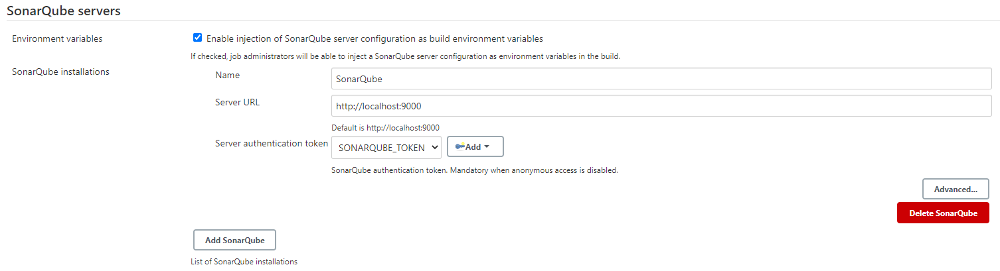
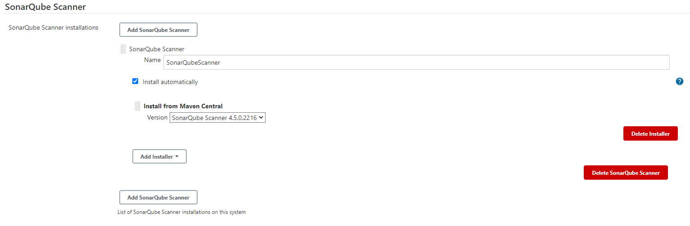
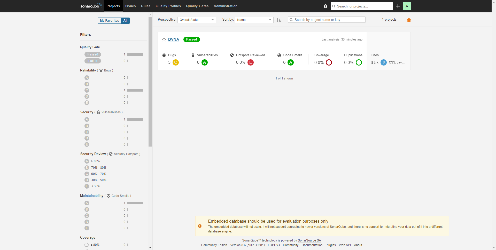

# Static Application Security Testing (SAST)

## Objective

This section aims to accomplish the objective listed as 6<sup>th</sup> point of [`Task 1`](../problem-statement/#task-1) under the [Problem Statement](../problem-statement).

## What is SAST?

SAST is testing the application source code, byte code and binaries for bugs and design errors from "inside out" before the application is deployed. It helps us detect and fix any problems that may introduce security vulnerabilities in the application.

While SCA allows us to monitor the components, SAST helps us analyze the source code of the application. Further differences between SCA and SAST are described very well in [this article](https://resources.whitesourcesoftware.com/blog-whitesource/sast-vs-sca){target="_blank"} from WhiteSource.

## Tools used for SAST

Each tool used was added as a new stage in the `jenkinsfile`. 

### [njsscan](https://github.com/ajinabraham/njsscan){target="_blank"}

`njsscan` is a SAST tool designed specifically for node.js applications. It implements pattern matching and syntax-aware semantic code pattern search to perform the complete analysis of source code for any vulnerabilities.

#### Installation

Since the tool is written in Python, we need to install the tool using `pip`.

```
pip install njsscan
```

**Note: **Make sure you are using Python 3.6+. Other Python versions are not supported.

The tool is automatically installed as global and can be used as a shell command directly.

#### Usage

The documentation provides us with the [command line options](https://github.com/ajinabraham/njsscan#command-line-options){target="_blank"}. I chose to execute the tool via a shell script to control the exit code:

```
#!/bin/bash

njsscan -o ~/reports/nodejsscan-report.json --json  ~/workspace/DVNA/
exit 0
```

- `-o`: Defines the output path.
- `--json`: Output to be presented in `JSON` format.

This script was included in the `jenkinsfile` with the following syntax:

```
stage ('Performing njsscan check') {
    steps {
        sh 'bash ~/scripts/njsscan.sh'
    }
}
```

**Note: **Another tool, built on top of njsscan known as [NodeJsScan](https://github.com/ajinabraham/nodejsscan){target="_blank"} provides a full fledged user interface for vulnerability management.

### [insider](https://github.com/insidersec/insider){target="_blank"}

`insider` is a CLI tool focused on discovering vulnerabilities listed in the [OWASP Top 10](https://owasp.org/www-project-top-ten/){target="_blank"}. It supports multiple languages and is aimed at implementation in CI/CD environments.

#### Installation

The tool is provided as a precompiled binary, hence we need to keep an actual copy of the tool on the Jenkins machine. The latest build can be downloaded from the [releases page](https://github.com/insidersec/insider/releases/){target="_blank"}. Once we locate the URL of the correct binary according to the OS and architecture, in our case Linux and x86, we can download it using the `wget` tool present in Linux.

```
wget https://github.com/insidersec/insider/releases/download/2.0.5/insider_2.0.5_linux_x86_64.tar.gz
```

This command will download the file in the current directory. Since the file is a `tar.gz` archive or a `tarball`, we need to extract it using the following command:

```
tar -xvf insider_2.0.5_linux_x86_64.tar.gz
```

Once we extract the archive, we get the `insider` binary. We need to make it executable on our system by using the following command:

```
chmod +x insider
```

Now we can launch the application using `./insider`.

#### Usage

The command-line options for the tool are available in the [GitHub Readme](https://github.com/insidersec/insider#usage){target="_blank"}. The tool generates the report in the directory where the binary is located, hence I needed to supply the `mv` command after the report was generated to move it to the correct directory. After supplying the required arguments the shell script was as follows:

```
#!/bin/bash

cd ~/scripts
./insider -tech javascript -no-html -force -target ~/workspace/DVNA
mv report.json ~/reports/insider-report.json
exit 0
```

- `-tech`: The language used in the application.
- `-no-html`: Tells the program to not generate the `HTML` report, as we only need the `JSON` report.
- `-force`: Overwrites the report file if present.
- `-target`: Target which needs to be analyzed (The directory which contains the application source code).

**Note: **We need to `cd` to the directory where the binary is located in order for the script to work. Shell commands through Jenkins are executed in the `~/workspace/Project_Name` directory by default. 

The tool was implemented in the `jenkinsfile` as a stage:

```
stage ('Performing insider check') {
    steps {
        sh 'bash ~/scripts/insider.sh'
    }
}
```

### [snyk.io](https://snyk.io/){target="_blank"}

`snyk` is an open-source security platform for finding out vulnerabilities in the source code of an application. 

#### Installation

`snyk` is available as an `npm` module for CLI usage. It can be installed using the command:

```
npm install snyk -g
```

This [guide](https://support.snyk.io/hc/en-us/articles/360003812458){target="_blank"} located on the website is quiet comprehensive and lists all the steps required to get the tool up and running.

#### Usage

The tool requires an initial authentication with your account on snyk.io. You can complete the authentication by using the link generated by the tool upon running `snyk auth`. Visit the link in your web browser and authenticate your account for use in the CLI.

Authentication is also possible by using the API token which is available on the [account page](https://app.snyk.io/account){target="_blank"}.

The API token was supplied to the script using the same approach as [`audit.js`](../software-composition-analysis/#auditjs) in the SCA phase, by using the `withCredentials()` function and defining the API token as a secret in Jenkins.

The shell script for this tool was as follows:

```
#!/bin/bash

cd ~/workspace/DVNA
snyk auth $SNYK_API_KEY
snyk test --json > ~/reports/snyk-report.json
exit 0
```

- `test`: Tells snyk to run the test.
- `--json`: Output to be printed in `JSON` format.

This script was implemented as a stage in the `jenkinsfile`:

```
stage ('Performind snyk.io analysis') {
    steps{
        withCredentials([string(credentialsId: 'SNYK_API_KEY', variable: 'SNYK_API_KEY')]) {
            sh 'bash ~/scripts/snyk.sh'
        }  
    }
}
```

**Note: **snyk.io also provides a web-based report, available on the dashboard if we use the tool in `monitor` mode, using the `snyk monitor` command. The report lists all the vulnerabilities sorted by their severity.


### [SonarQube Scanner](https://www.sonarqube.org/){target="_blank"}

SonarQube is an open-source tool used to analyze source code, manage source code quality and . It is split into multiple components, with a server being the base and additional tools used in sync with the server, in our case the [SonarQube Scanner](https://docs.sonarqube.org/latest/analysis/scan/sonarscanner/){target="_blank"}.

#### Installation

The complete installation is split into multiple steps, starting with setting up the server, configuring the server in Jenkins and installing the SonarQube plugin for the scanner to work.

I followed [this guide](https://medium.com/@harith.sankalpa/how-to-integrate-sonarqube-into-your-node-js-ts-application-for-better-analysis-of-your-code-91d830e80ec3){target="_blank"} for installation and configuration of SonarQube.

##### Server setup

To install the SonarQube server, we need to download the `zip` available on the [SonarQube website](https://www.sonarqube.org/downloads/){target="_blank"}. We can download the file using the `wget` command :

```
wget https://binaries.sonarsource.com/Distribution/sonarqube/sonarqube-8.6.0.39681.zip
```

This will save the file in the current directory. We need to unzip the archive by using the `unzip` command. After that we need to navigate to `sonarqube-8.6.0.39681/bin/linux-x86-64` and run `sonar.sh start` in order to start the server.

Once we start the server, we can access it at `http://SERVER_IP:9000`. On the initial login we will use the default credentials `admin:admin` as stated in the [official guide](https://docs.sonarqube.org/latest/instance-administration/security/){target="_blank"}. Upon changing the password we are greeted by the SonarQube dashboard.

We need to generate a token for the user authentication which will be used in further steps. Navigate to `My Account > Security > Tokens`, enter the desired token name and generate the token. We need to store this token immediately as this will not be visible later.

We will define the token as a Jenkins secret with the name `SONARQUBE_TOKEN`. This can be done in 

Once we have the server up and running, we need to configure its details in the SonarQube plugin for Jenkins. 

##### Plugin Setup

Since we will be using the [`Sonar Scanner`](https://docs.sonarqube.org/latest/analysis/scan/sonarscanner-for-jenkins/){target="_blank"} addon for scanning our project, we need to install the component. It is available as a Jenkins plugin which we can install by navigating to `Manage Jenkins > Manage Plugins > Available`, searching for the plugin `Sonar Scanner` and installing it. Now we need to configure the SonarQube server and the Scanner in Jenkins.

Navigate to `Manage Jenkins > Configure System > SonarQube servers` in the Jenkins dashboard. Click on `Enable injection of SonarQube server configuration as build environment variables`, this option allows us to use the server configuration for the SonarQube Scanner which we will install in the next step. Set the name of the server and define the IP address for the same. We also need to provide an authentication token which we stored as a Jenkins secret earlier.



##### Scanner Setup

To configure the installation of SonarQube Scanner, we navigate to `Manage Jenkins > Global Tool Configuration > SonarQube Scanner`, click the `SonarQube Scanner installations` button, use the `Add SonarQube Scanner` option and configure it to fetch the latest version of the scanner binary from [Maven Central Repoistory](https://mvnrepository.com/artifact/org.sonarsource.scanner.maven/sonar-maven-plugin){target="_blank"} and install it in the environment automatically.



#### Usage

Since we are using the SonarQube plugin in Jenkins, we can generate the `jenkinsfile` syntax using the `Generate Syntax` option in the Jenkins project dashboard. 

```
stage ('Performing SonarQube analysis') {
    environment {
        scannerHome = tool 'SonarQubeScanner'
    }

    steps {
        withSonarQubeEnv ('SonarQube') {
            sh '${scannerHome}/bin/sonar-scanner -Dsonar.projectKey="DVNA" -Dsonar.projectBaseDir="/var/lib/jenkins/workspace/DVNA"'
        }
    }
}
```

**Note: ** I was having some issues in implementing the Scanner with jenkinsfile, all issues were cleared using [this answer](https://stackoverflow.com/questions/48557886/.how-to-execute-sonarqube-scanner-in-jenkins-declarative-pipeline-without-maven-a){target="_blank"}, which provided me with the correct syntax.

Once the scanner has analyzed the application, the results are posted to the SonarQube dashboard which can be accessed using `http://SERVER_IP:9000`. The report provides a list of all the bugs and vulnerabilities.



**Note: **Both, the SonarQube Server and Scanner are available as Docker images which allow for easier use and configuration of the tool.

### SAST Reports

All of the reports generated by various tools were stored in JSON format under the `reports` folder located in the default home directory of the Jenkins user at `/var/lib/jenkins`.